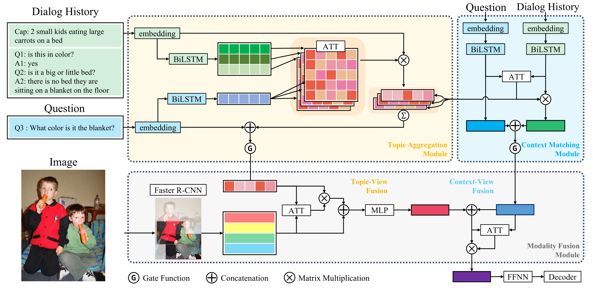

Multi-View Attention Networks for Visual Dialog
====================================
Implements the model described in the following paper [Multi-View Attention Networks for Visual Dialog](https://arxiv.org/abs/2004.14025).
```
@article{park2020multi,
  title={Multi-View Attention Networks for Visual Dialog},
  author={Park, Sungjin and Whang, Taesun and Yoon, Yeochan and Lim, Heuiseok},
  journal={arXiv preprint arXiv:2004.14025},
  year={2020}
}
```
This code is reimplemented as a fork of [batra-mlp-lab/visdial-challenge-starter-pytorch][1] and [yuleiniu/rva][2].


Setup and Dependencies
----------------------
This code is implemented using PyTorch v1.3.1, and provides out of the box support with CUDA 10 and CuDNN 7.  
Anaconda / Miniconda is the recommended to set up this codebase.  
### Anaconda or Miniconda
Clone this repository and create an environment:
```shell
git clone https://www.github.com/taesunwhang/MVAN-VisDial
conda create -n mvan_visdial python=3.7

# activate the environment and install all dependencies
conda activate mvan_visdial
cd MVAN-VisDial/
pip install -r requirements.txt
```
Data
-------------
1. Download the VisDial v0.9 and v1.0 dialog json files from [here][3] and keep it under `$PROJECT_ROOT/data/v0.9` and `$PROJECT_ROOT/data/v1.0` directory, respectively.
2. [batra-mlp-lab][1] provides the word counts for VisDial v1.0 train split [`visdial_1.0_word_counts_train.json`](https://s3.amazonaws.com/visual-dialog/data/v1.0/2019/visdial_1.0_word_counts_train.json). They are used to build the vocabulary. Keep it under `$PROJECT_ROOT/data/v1.0` directory.
3. If you wish to use preprocessed textaul inputs, we provide preprocessed data [here][4] and keep it under `$PROJECT_ROOT/data/visdial_1.0_text` directory.
4. For the pre-extracted image features of VisDial v1.0 images, [batra-mlp-lab][1] provides Faster-RCNN image features pre-trained on Visual Genome. Keep it under `$PROJECT_ROOT/data/visdial_1.0_img` and set argument `img_feature_type` to `faster_rcnn_x101` in `config/hparams.py` file.
  * [`features_faster_rcnn_x101_train.h5`](https://s3.amazonaws.com/visual-dialog/data/v1.0/2019/features_faster_rcnn_x101_train.h5): Bottom-up features of 36 proposals from images of `train` split.
  * [`features_faster_rcnn_x101_val.h5`](https://s3.amazonaws.com/visual-dialog/data/v1.0/2019/features_faster_rcnn_x101_val.h5): Bottom-up features of 36 proposals from images of `val` split.
  * [`features_faster_rcnn_x101_test.h5`](https://s3.amazonaws.com/visual-dialog/data/v1.0/2019/features_faster_rcnn_x101_test.h5): Bottom-up features of 36 proposals from images of `test` split.
5. [gicheonkang][5] provides pre-extracted Faster-RCNN image features, which contain bounding boxes information. Set argument `img_feature_type` to `dan_faster_rcnn_x101` in `config/hparams.py` file.
  * [`train_btmup_f.hdf5`][6]: Bottom-up features of 10 to 100 proposals from images of `train` split (32GB).
  * [`train_imgid2idx.pkl`][7]: `image_id` to bbox index file for `train` split 
  * [`val_btmup_f.hdf5`][8]: Bottom-up features of 10 to 100 proposals from images of `validation` split (0.5GB).
  * [`val_imgid2idx.pkl`][9]: `image_id` to bbox index file for `val` split
  * [`test_btmup_f.hdf5`][10]: Bottom-up features of 10 to 100 proposals from images of `test` split (2GB).
  * [`test_imgid2idx.pkl`][11]: `image_id` to bbox index file for `test` split  
  
Initializing GloVe Word Embeddings
--------------

Download the GloVe pretrained word vectors from [here][12], and keep `glove.6B.300d.txt` under `$PROJECT_ROOT/data/word_embeddings/glove` directory.  
Simply run
```shell
python data/preprocess/init_glove.py
```
Model Training
--------
Train the model provided in this repository as:
```shell
python main.py --model mvan --version 1.0
```
### Initializing with Pre-trained Model  
Set argument `load_pthpath` to `/path/to/checkpoint.pth` in `config/hparams.py` file.
### Saving model checkpoints  
Model chekcpoints are saved for every epoch. Set argument `save_dirpath` in `config/hparams.py` file.  

Evaluation
----------
Evaluation of a trained model checkpoint can be done as follows:
```shell
python evaluate.py --model mvan --evaluate /path/to/checkpoint.pth --eval_split val
```
If you wish to evaluate the model on `test` split, replace `--eval_split val` with `--eval_split test`.  
This will generate a json file for each split to evaluate on various metrics (Mean reciprocal rank, R@{1, 5, 10}, Mean rank, and Normalized Discounted Cumulative Gain (NDCG)).  
If you wish to evaluate on `test` split, [EvalAI](https://evalai.cloudcv.org/web/challenges/challenge-page/518/overview) provides the evaluation server.  

[1]: https://www.github.com/batra-mlp-lab/visdial-challenge-starter-pytorch
[2]: https://github.com/yuleiniu/rva
[3]: https://visualdialog.org/data
[4]: https://drive.google.com/drive/folders/1LfXqxm29Dj0Lv0qpQ1zDOocEtihCw6L7?usp=sharing
[5]: https://github.com/yuleiniu/rva
[6]: https://drive.google.com/file/d/1NYlSSikwEAqpJDsNGqOxgc0ZOkpQtom9/view?usp=sharing
[7]: https://drive.google.com/file/d/1QSi0Lr4XKdQ2LdoS1taS6P9IBVAKRntF/view?usp=sharing
[8]: https://drive.google.com/file/d/1NI5TNKKhqm6ggpB2CK4k8yKiYQE3efW6/view?usp=sharing
[9]: https://drive.google.com/file/d/1nTBaLziRIVkKAqFtQ-YIbXew2tYMUOSZ/view?usp=sharing
[10]: https://drive.google.com/file/d/1BXWPV3k-HxlTw_k3-kTV6JhWrdzXsT7W/view?usp=sharing
[11]: https://drive.google.com/file/d/1_32kGhd6wKzQLqfmqJzIHubfZwe9nhFy/view?usp=sharing
[12]: http://nlp.stanford.edu/data/glove.6B.zip
